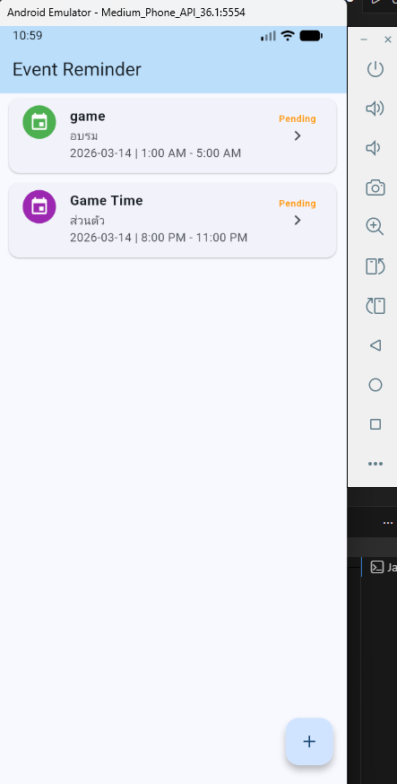
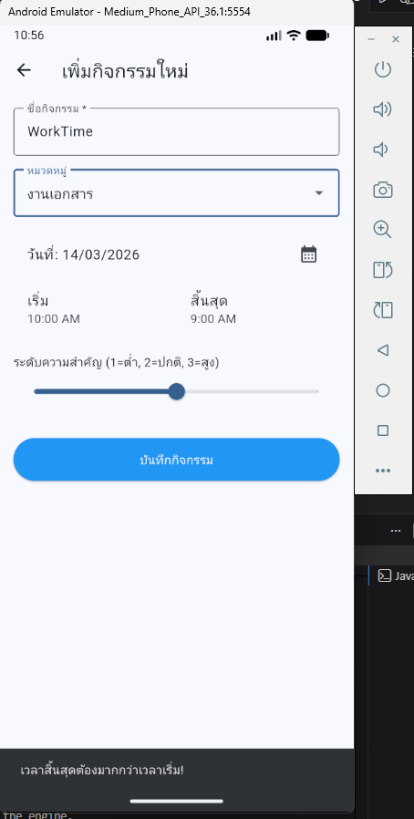
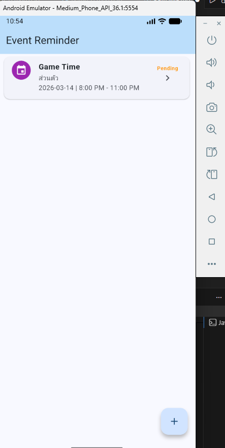
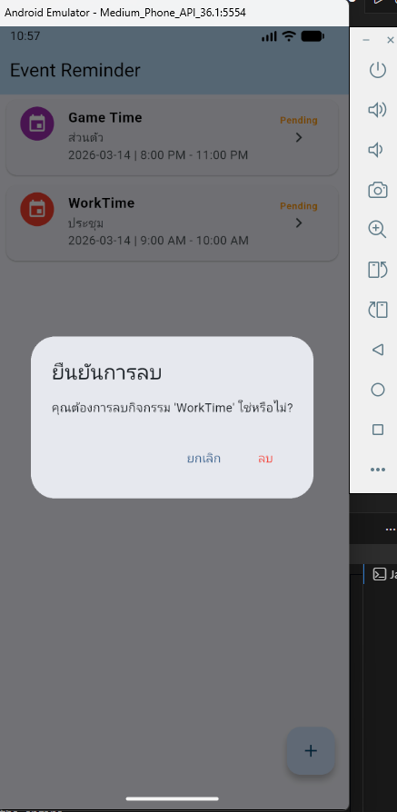

    ภาณวัฒน์  ยาท้วม  67543210043-5


# 📅 Event & Reminder App (Lab 11)

แอปพลิเคชันจัดการกิจกรรมและแจ้งเตือนแบบ Offline โดยใช้ฐานข้อมูลภายในเครื่อง (Local Database)

## 🎯 วัตถุประสงค์
* ศึกษาการจัดการฐานข้อมูลด้วย **SQLite (sqflite)**
* การทำ CRUD (Create, Read, Update, Delete) ข้อมูลแบบ Relational (Events & Categories)
* จัดการสถานะแอปพลิเคชันด้วย **Provider**
* พัฒนาระบบตรวจสอบข้อมูล (Input Validation) เช่น การตรวจสอบช่วงเวลา

## ✨ ฟีเจอร์สำคัญ (Key Features)
* **Category System:** มีระบบหมวดหมู่พร้อมสีสัญลักษณ์ ช่วยให้จำแนกงานได้ง่าย
* **Seed Data:** ระบบสร้างหมวดหมู่พื้นฐาน 5 ประเภทอัตโนมัติเมื่อเริ่มใช้งานครั้งแรก
* **Time Validation:** ป้องกันการกรอกเวลาผิดพลาด (เวลาจบต้องมากกว่าเวลาเริ่ม)
* **Priority Levels:** กำหนดความสำคัญได้ 3 ระดับ ผ่าน Slider UI
* **Status Tracking:** แสดงสถานะกิจกรรมด้วยสีที่ต่างกัน (Pending, In Progress, Completed, Cancelled)

## 📁 โครงสร้างโฟลเดอร์ (Project Structure)
```text
lib/
├── data/
│   ├── db/          # DatabaseHelper (SQLite Connection)
│   └── models/      # Event & Category Models
├── ui/
│   ├── state/       # EventProvider (State Management)
│   └── screens/     # HomeScreen & AddEventScreen
└── main.dart        # Entry Point & Provider Setup
```

📸 ภาพตัวอย่างการทดสอบ

1. หน้าหลักและการแสดงผล: []
2. การเพิ่มกิจกรรม: []
3. ระบบ Validation: []
4. การลบข้อมูล(แตะค้างเพื่อลบ): []
