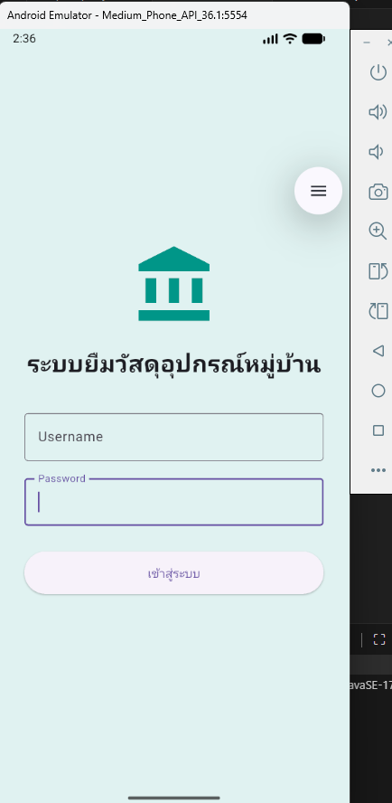
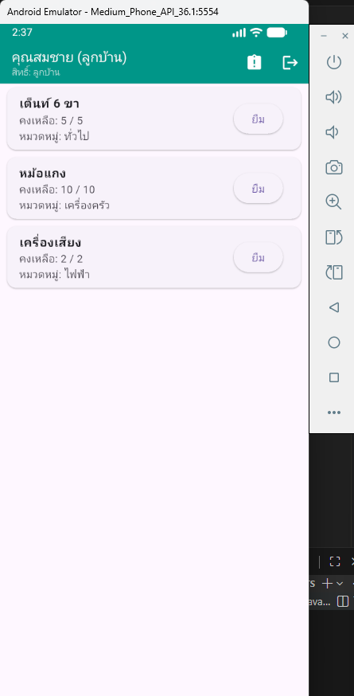
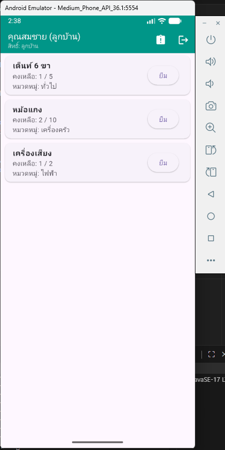
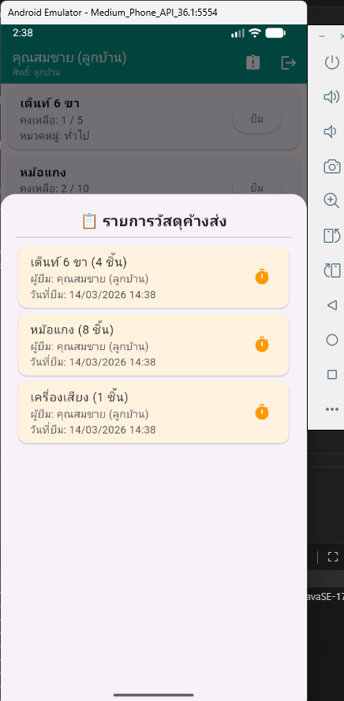
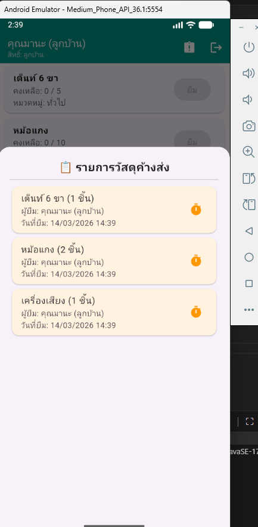
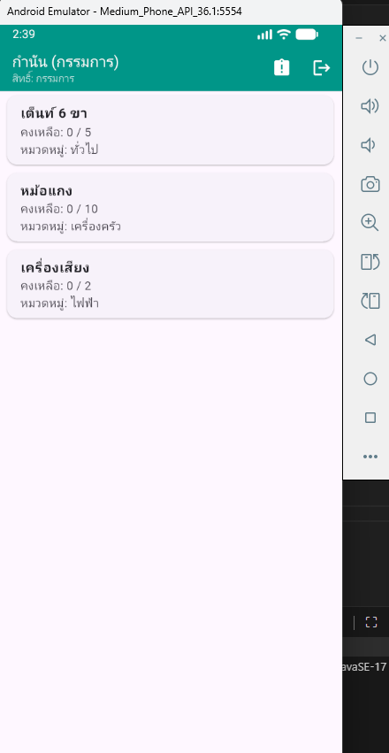
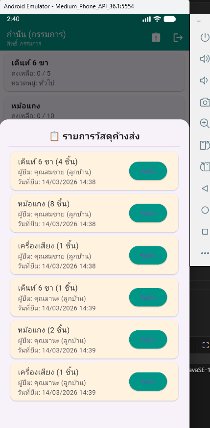
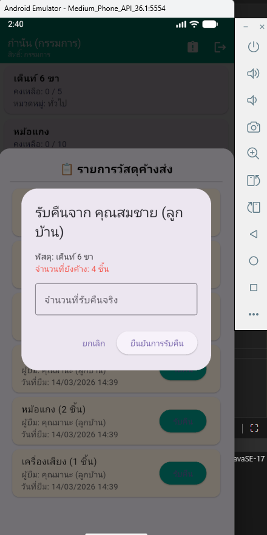

# 📦 Village Asset Management System
### 🏠 ระบบบริหารจัดการยืม-คืนพัสดุหมู่บ้านอัจฉริยะ

---

## 📖 ภาพรวมโครงการ (Project Overview)
แอปพลิเคชันสำหรับบริหารจัดการการยืมและคืนวัสดุอุปกรณ์ภายในชุมชน พัฒนาด้วยเทคโนโลยี **Flutter** และระบบฐานข้อมูล **SQLite** โดยเน้นความง่ายในการใช้งาน ความโปร่งใส และการตรวจสอบสถานะพัสดุแบบ Real-time

---

## ✨ คุณสมบัติเด่น (Key Features)

| ฟีเจอร์ | รายละเอียดการทำงาน |
| :--- | :--- |
| **🔐 Role-Based Access** | แยกหน้าจอกรรมการ (Admin) และลูกบ้าน (User) อัตโนมัติเมื่อ Log-in |
| **📦 Smart Inventory** | ตรวจสอบจำนวนคงเหลือในคลัง และป้องกันการยืมเกินจำนวนที่มีจริง |
| **🔍 Tracking System** | ติดตามรายการค้างส่งแยกตามรายชื่อ พร้อมระบุวันที่ยืมอย่างละเอียด |
| **🔄 Individual Return** | กรรมการเลือกรับคืนของจากลูกบ้านเป็นรายคน (รองรับการคืนบางส่วน) |
| **💾 Persistent Storage** | จัดเก็บข้อมูลพัสดุและประวัติทั้งหมดไว้ในตัวเครื่องด้วย SQLite |

---

## 👥 ข้อมูลสำหรับการทดสอบ (Test Credentials)

> [!TIP]
> กรุณาใช้บัญชีเหล่านี้เพื่อทดสอบฟังก์ชันตามสิทธิ์ที่ต่างกัน

* **👨‍💼 สิทธิ์กรรมการ (Admin):**
  * **Username:** `admin_kamnan` | **Password:** `9999`
  * *สิทธิ์: ดูรายการค้างส่งทั้งหมด, รับคืนของจากลูกบ้านทุกคน*

* **👨‍👩‍👧‍👦 สิทธิ์ลูกบ้าน (User):**
  * **Username:** `somchai_jaide` | **Password:** `1234`
  * **Username:** `mana_reakdee` | **Password:** `1234`
  * *สิทธิ์: ยืมของ, ดูรายการที่ตัวเองค้างส่งเท่านั้น*

---

📸 ตัวอย่างหน้าจอการใช้งาน (App Preview)

