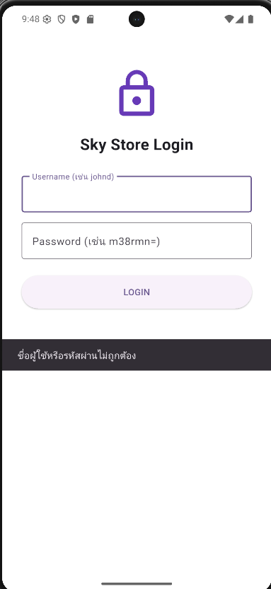
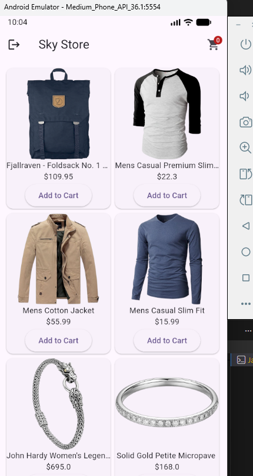
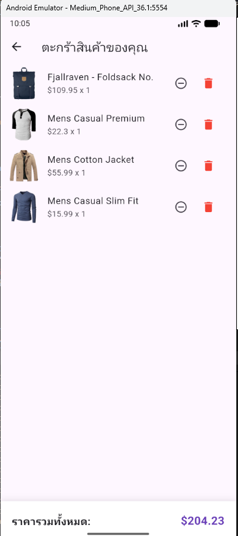
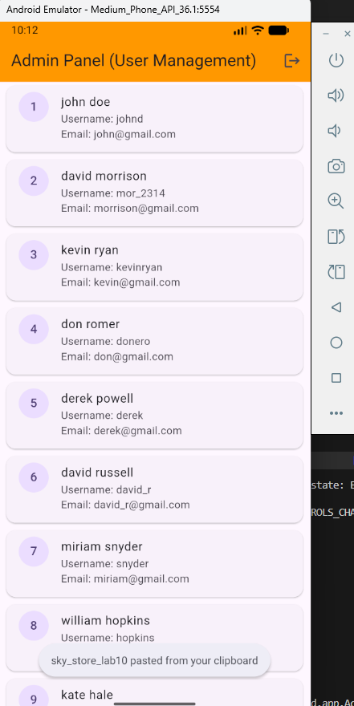

  ภาณุวัฒน์  ยาท้วม  67543210043-5


# 🛍️ SkyStore - API Data Management & Shopping Cart (Lab 10)

โปรเจกต์นี้เป็นส่วนหนึ่งของรายวิชา **การพัฒนาแอปพลิเคชันมือถือ** โดยเน้นการจัดการข้อมูลผ่าน Web API (CRUD), การจัดการสถานะ (State Management) ด้วย Provider และการทำระบบสิทธิ์ผู้ใช้งาน (RBAC)

---

## 🎯 วัตถุประสงค์ (Objectives)
* เชื่อมต่อและจัดการข้อมูลจาก **FakeStoreAPI** แบบ Asynchronous
* จัดการสถานะตระกร้าสินค้าและระบบ Login ด้วย **Provider**
* ออกแบบระบบแยกสิทธิ์ระหว่าง **Admin** และ **User** (Role-based Access Control)
* พัฒนา UI แบบแยกส่วน (Clean Architecture) เพื่อความง่ายในการบำรุงรักษา

---

## ✨ คุณสมบัติของระบบ (Features)

### 1. ระบบ Authentication & RBAC
* ตรวจสอบสิทธิ์การเข้าใช้งานผ่านข้อมูลจาก API
* **Admin (johnd):** สามารถเข้าถึงหน้า **Admin Panel** เพื่อจัดการข้อมูลผู้ใช้งาน (User Management)
* **User ทั่วไป:** เข้าสู่หน้ารายการสินค้าเพื่อเลือกซื้อสินค้าได้ตามปกติ

> **[]**

### 2. ระบบรายการสินค้า (Product Catalog)
* ดึงข้อมูลสินค้าทั้งหมดจาก `/products` มาแสดงผลในรูปแบบ Grid View
* มีระบบ Badge แสดงจำนวนสินค้าในตระกร้าบน Icon รถเข็นแบบ Real-time
* กดที่สินค้าเพื่อดูรายละเอียด (Description) แบบเต็มได้

> **[]**

### 3. ระบบตระกร้าสินค้า (Shopping Cart System)
* **Create/Read:** เพิ่มสินค้าลงตระกร้าได้จากหน้าหลักและหน้าละเอียด
* **Update/Delete:** สามารถเพิ่ม-ลดจำนวนสินค้า หรือลบสินค้าออกจากตระกร้าได้
* **Calculation:** คำนวณราคาสวมสุทธิ (Total Price) อัตโนมัติเมื่อมีการเปลี่ยนแปลงข้อมูล

> **[]**

### 4. ระบบจัดการผู้ใช้ (Admin Management)
* เฉพาะ Admin เท่านั้นที่เข้าหน้านี้ได้
* ดึงรายชื่อผู้ใช้ทั้งหมดจาก `/users` มาแสดงผลในรูปแบบ List Card

> **[]**

---

## 📁 โครงสร้างโปรเจกต์ (Project Structure)
มีการแบ่งโฟลเดอร์ตามหลักการแยกส่วน (Separation of Concerns):
```text
lib/
├── models/      # โครงสร้างข้อมูล (Product Model)
├── providers/   # การจัดการ State (Cart Provider)
├── screens/     # หน้าจอ UI ต่างๆ (Login, List, Detail, Cart, Admin)
└── main.dart    # จุดเริ่มต้นและการตั้งค่า Provider


API Endpoints ที่ใช้งาน


GET	/users	ตรวจสอบ Login และดึงรายชื่อผู้ใช้สำหรับ Admin

GET	/products	ดึงรายการสินค้าทั้งหมดมาแสดงผล

GET	/products/{id}	ดึงข้อมูลสินค้าเฉพาะชิ้นเพื่อแสดงรายละเอียด


วิธีการรันโปรเจกต์


ติดตั้ง Dependencies: flutter pub get

รันแอปพลิเคชัน: flutter run


ข้อมูลสำหรับทดสอบ


Admin: johnd / m38rmn=

User: mor_2314 / 83r5^_